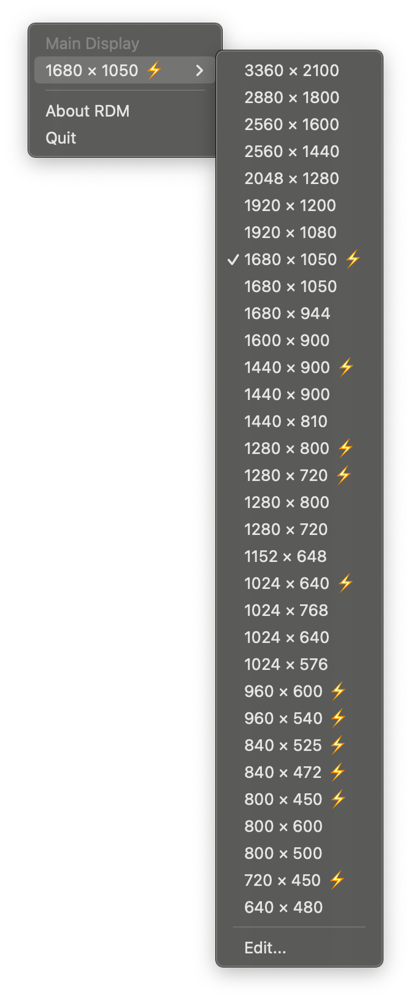
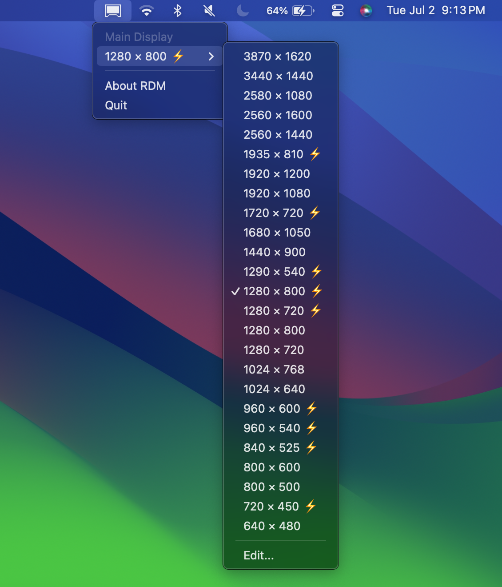
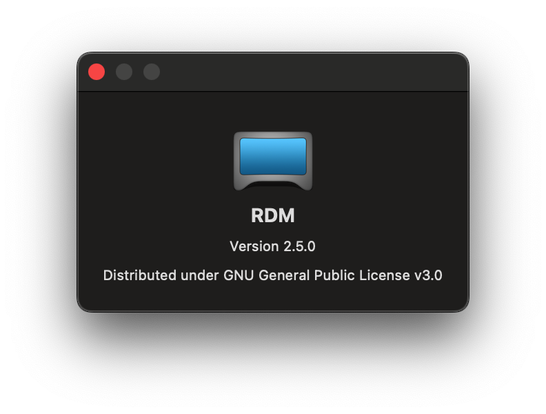

# RDM 
<p id="description" />
    RDM enables unsupported high resolutions on Macs. Set your Mac display to higher unsupported screen resolutions.
</p>



## List of contents
- [Description](#description)
- [Compatibility](#compatibility)
- [Example](#example)
- [Screenshots](#screenshots)
- [Installation](#installation)
- [Additional information](#additional-information)

## Compatibility
- Mac
    - RDM may work on all Mac computers, but that is not guaranteed. 
- macOS
    - OS X Snow Leopard 10.6 and newer

> Tested on macOS Sonoma (released in 2023).

> [!NOTE]
> RDM might work on older macOS versions than Snow Leopard, but that is not guaranteed. 

## Example
<p>The MacBook Pro (13-inch, Mid 2012) with non-Retina display can be set to 2560x1600 maximum resolution, as opposed to Apple's max supported 1280x800 natively.</p>
<p>It is accessible from the menu bar.</p>

## Screenshots
<table>
    <tr>
        <th>Menu</th><th>About RDM</th>
    </tr>
    <tr>
        <td></td>
        <td></td>
    </tr>
</table>

## Installation
- DMG
    - Click and drag the RDM app to the Applications folder
- PKG
    - You will be proceeded through the installation, follow the steps.

## Additional information
> [!NOTE]
> RDM may not work on all Mac computers.

> [!NOTE]
> You should prefer resolutions marked with ```⚡️``` (lightning), which indicates the resolution is HiDPI or 2× or more dense in pixels.

> [!TIP]
> To run RDM automatically on startup, add RDM.app to your **Login Items** in <br />
> - macOS Monterey 12 and earlier: **System Preferences → Users & Groups → Login Items**<br />
> - macOS Ventura 13 and newer: **System Settings → General → Login Items**<br />

<hr>
For more information regarding the RDM app, read more in <a href="https://github.com/avibrazil/RDM" />the original repository</a>.

<br>